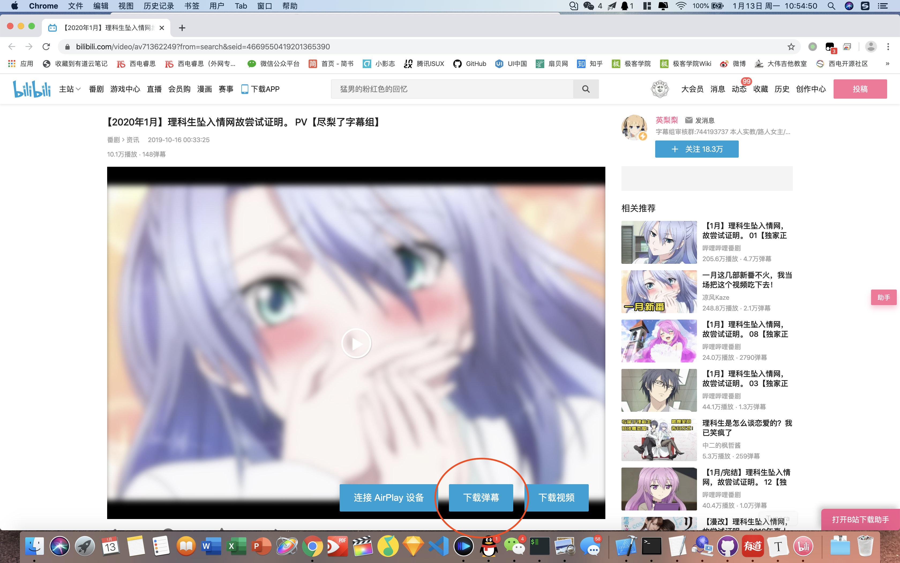
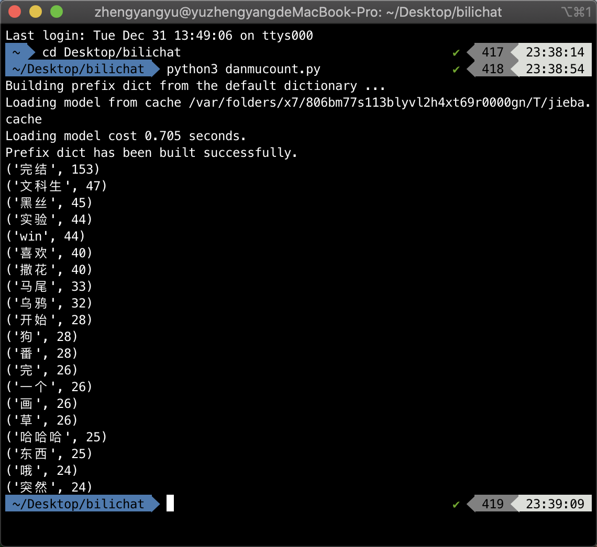

# bilichatcount
 A word frequency statistics tool for bilibili danmus

---

### 介绍

本repo基于中文词频分析库[jieba](https://github.com/fxsjy/jieba)，部分代码参考自[这个页面](https://blog.csdn.net/lger_Pro/article/details/79732766)，使用Python3，在MacOS上测试通过。

### 使用方式

+ 在你所在的Python环境安装jieba库（pip，anaconda都可）。

+ 安装[BiliMac及Chrome插件](https://github.com/typcn/bilibili-mac-client/releases)，打开BiliMac，并在Chrome中打开你要下载弹幕的视频播放页，点击`下载弹幕`：

+ 随后在本机的`$HOME/Movies/Bilibili/`找到下好的文件夹，将里面的xml文件重命名为`bilichat.xml替换入repo中。

+ 运行`python danmucount.py`

（可适当修改`meaningless.txt`，去除无关虚词）

### 未来规划

+ 修改程序，不依赖bilimac.app，直接提取xml

+ 让程序更加自动化

+ 集成文字云功能